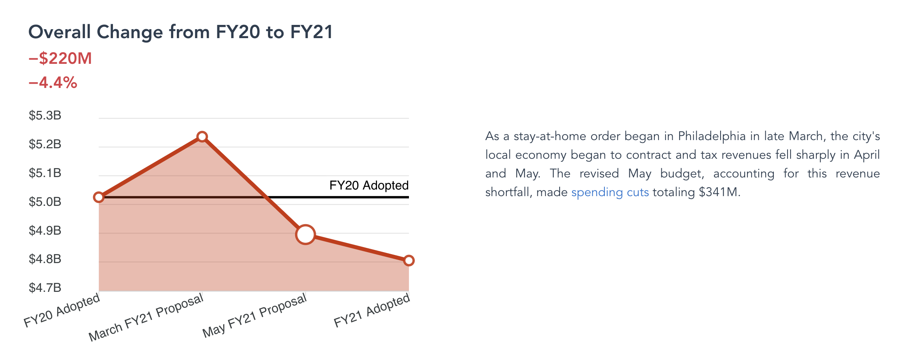
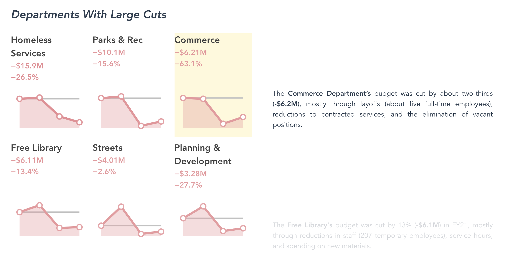
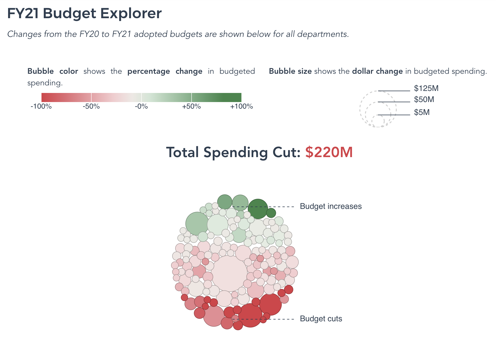

# Visualizing the Adopted FY21 Budget

The code behind the interactive visualization of Philadelphia's adopted FY21 budget.

The interactive visualization is available [here](https://controller.phila.gov/philadelphia-audits/interactive-fy21-budget/).





## Tools

The application is built using a combination of open-source tools, including
[vue](https://github.com/vuejs/vue), [d3](https://github.com/d3/d3), and [apexcharts](https://github.com/apexcharts/vue-apexcharts).

## Development

### Project setup
```
npm install
```

### Compiles and hot-reloads for development
```
npm run serve
```

### Compiles and minifies for production
```
npm run build
```
